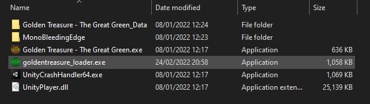

# Welcome to the CountablyInfiniteGreen wiki!

Mod and user content loader for "Golden Treasure - The Great Green"

This wiki is aim to provide user-friendly steps for anyone without extensive knowledge of IT skills to navigate the mods.

## How to install this Mod loader (As a user)

1. From the [Releases Page](../releases/), download the lastest version's
	"goldentreasure\_loader.exe"

2. Place it at the root of the  "Golden Treasure The Great Green" installation folder 
This folder may be found from Steam with [Gear icon] -> Manage -> Browse local
files, or from the desktop icon with [Right click] -> Open file location 

3. Start the game by launching through the "goldentreasure_loader.exe"

Check bottom-left corner of your game's MainMenu, it should consist of game version number + loader version number

