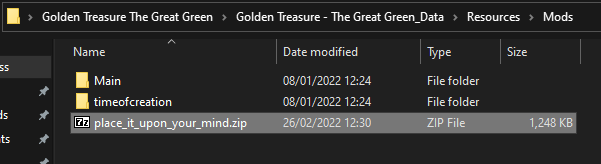

# How to add mod content into the game?

This page will teach you how to:

- navigate to mod content folder
- add mod into your game
- use Profile Manager to enable them, and manage your savegames

## Mod content folder location

To navigate to your mod folder, start again from the game root folder from the
'install loader' step

* Go to \Golden Treasure - The Great Green_Data\Resources\Mods.

Each folder here will correspond to an installed mod available to play

## Adding mod content.

To add a mod content, copy the mod content intended for this game, into the mod content location.

We will be using the included technical example "place it upon your mind" mod as an example for this guide.

1. Obtain archive, in our case from the [Release page](../releases) -> "place_it_upon_your_mind.zip"

2. Place zip into the Mod content folder like so: 
It will be processed when the game is started 

## Managing Profiles

* Open your game by launching the "goldentreasure_loader.exe" and click the word "Profile"
on the bottom-right of the main menu screen.

A 'Profile' is a Savegame (current life + all permanent progress) + a list of
enabled mods

It is preferable you start by making a copy of 'Default', and only play modified
games on the copies

/!\ If you start the original game again (through Steam or the yellow dragon
icon), it will not load the "Default" savegame, but the last one you played
with the modified version. Which might not make sense to it 
You will have to come back here to switch profiles

* You should see all folders if they are correctly installed. The checkboxes
	(crossed/uncrossed circles) select the active ones for the current profile

* Drag the planks up and down to control loading order 
A mod supposed to replace existing events or art should appear lower on the list

